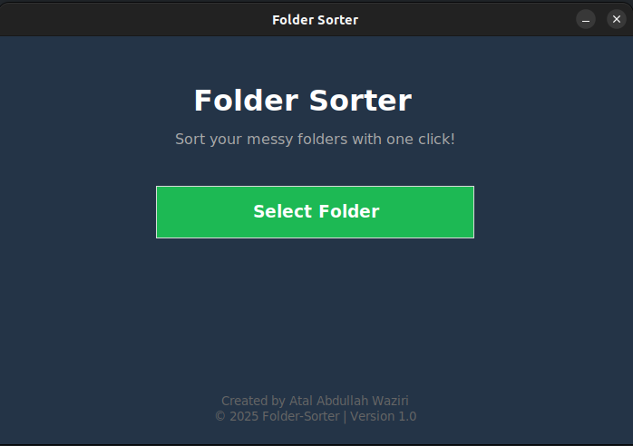
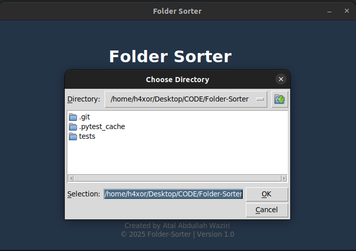
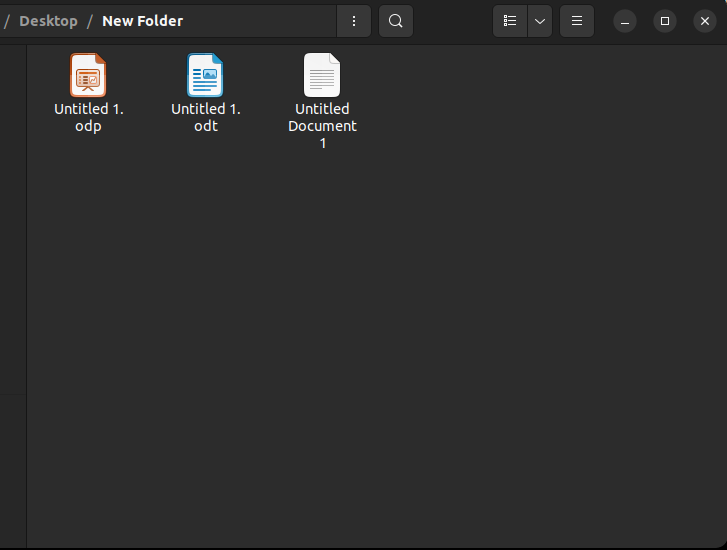
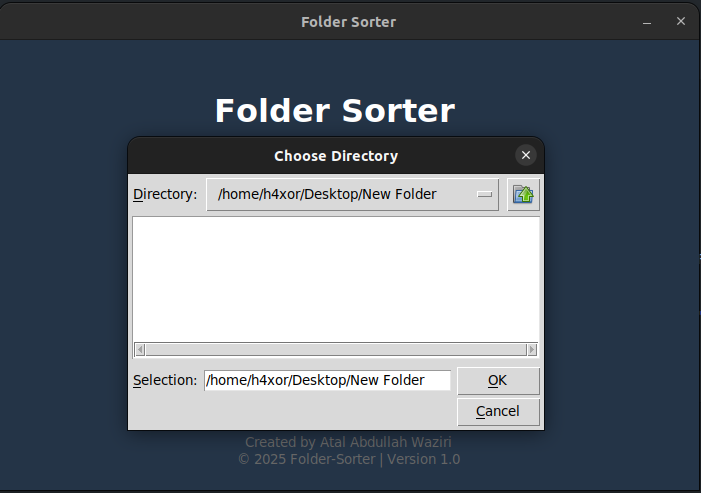
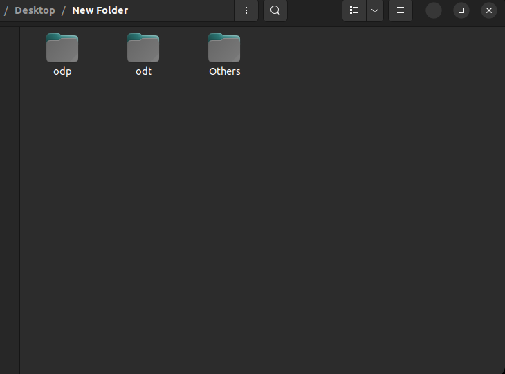
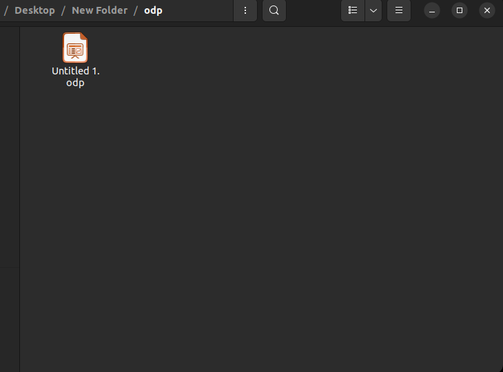

# 📁 Folder Sorter

A cross-platform (Linux and Windows) graphical utility that helps you **organize cluttered folders by sorting files into subfolders based on their file extensions**. Built with a C backend for performance and a Python Tkinter GUI frontend for ease of use.

---

## 🌟 Features

* ✅ **One-click folder sorting** via a simple GUI.
* ✅ **Automatically creates folders** based on file extensions.
* ✅ Files without extensions go into an **`Others/`** folder.
* ✅ Fully supports both **Linux** and **Windows**.
* ✅ Uses a **compiled C backend** for speed and reliability.
* ✅ Clean UI with error handling.
* ✅ Tested via automated Python tests using `pytest`.

---

## 🌐 Screenshots

| GUI Screen                             | Folder Selection                              | Before Sorting                                |
| -------------------------------------- | --------------------------------------------- | --------------------------------------------- |
|  |  |  |

| Selecting Folder                                       | After Sorting                                       | Sorted by Extension                        |
| ------------------------------------------------------ | --------------------------------------------------- | ------------------------------------------ |
|  |  |  |

---

## ⚙️ Requirements

| Tool            | Version                                     |
| --------------- | ------------------------------------------- |
| Python          | >= 3.8                                      |
| GCC (Linux)     | Required for compiling `folder_sorter.c`    |
| MinGW (Windows) | Optional for building `.dll` on Windows     |
| `make`          | (Linux/Unix only) Used for automated builds |

> **Note**: No external Python packages required. The GUI uses built-in `tkinter` only.

---

## 📄 Project Structure

```bash
Folder-Sorter/
├── .github/workflows/tests.yml     # GitHub Actions CI for Windows/Linux
├── assets/                         # Screenshots used in README
├── backend/                        # C source code and build scripts
│   ├── folder_sorter.c             # Main logic (cross-platform C backend)
│   ├── Makefile                    # Builds .so (Linux)
│   └── build.bat                   # Builds .dll (Windows)
├── frontend/
│   └── folder_sorter_gui.py        # Python GUI using Tkinter
├── shared/                         # Compiled shared libraries (.so/.dll)
│   └── folder_sorter.so            # (Ignored by Git; built during setup)
├── tests/
│   └── test_folder_sorter.py       # Pytest tests for backend behavior
├── .gitignore                      # Prevents binaries, cache, etc.
├── LICENSE                         # Project license
├── README.md                       # You are here
```

> **Note:** The `shared/` directory is used to store compiled binaries. These are ignored from Git for portability reasons.

---

## 💪 How to Build & Run

### 🌬️ Step-by-step (Linux):

```bash
git clone https://github.com/waziri245/Folder-Sorter.git
cd Folder-Sorter/backend
make                        # Compiles folder_sorter.so into ../shared/
cd ../frontend
python3 folder_sorter_gui.py
```

### 🌐 Step-by-step (Windows):

```bat
git clone https://github.com/yourusername/Folder-Sorter.git
cd Folder-Sorter\backend
build.bat                  # Builds folder_sorter.dll into ..\shared\
cd ..\frontend
python folder_sorter_gui.py
```

---

## 📁 How It Works

1. You launch the GUI and select a folder.
2. The GUI passes that folder to a C backend using `ctypes`.
3. The C program scans all files in that folder:

   * Moves each file to a folder based on its extension.
   * If a file has no extension, it's moved to an `Others` folder.
4. On success, a message box is shown. Done!

---

## ✌️ License

This project is licensed under the terms described in the `LICENSE` file.

---

## 🧑‍💻 Author

Developed by  **Atal Abdullah Waziri**  
🎓 Co-founder of [Stellar Organization](https://stellarorganization.mystrikingly.com/).

---

Thank you for using **Folder Sorter** — your folders will thank you too 😉
